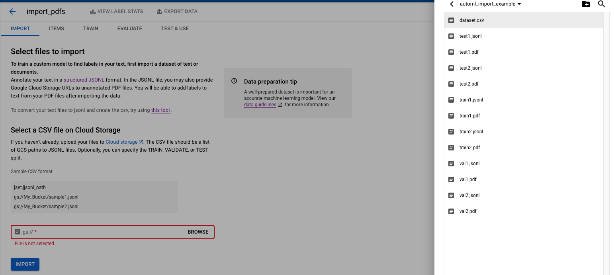
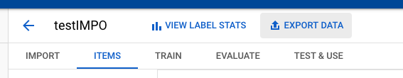

## This script describes how to annotate Entities in PDF documents using a dictionary file in a semi-automated way.

**4 steps in the process**
- Import PDF data to AutoML (and let AutoML do the text extraction for you)
- Export the data after AutoML process them during import, to a GCS location
- Pull the data from GCS and process using a dictionary in order to tag entities
- Import the data again to AutoML NL


### Import PDF data to AutoML NL Entities
Generate structure for import on AutoML and upload to GCS

- **Ensure there are no pdfs with same name if you are pulling from different folders**
- **Ensure bucket is empty or that you do not mind overwritting existing files with same filename**

*Modify the bucket path below*
```
export BUCKET=gs://bucket/export_path/ 
python2.7 input_helper_v2.py -v -s train,train/*.pdf validation,val/*.pdf test,test/*.pdf -t ${BUCKET}
```

<br >
<br >

Upload the generated data from your path gs://bucket/export_path/ to AutoML NL Entities Using the UI


<br >
<br >

### Export AutoML NL Entities Data
After the import is done, export the data using the UI (The export might be dissabled for a while, try refreshing the page)




### Process using a dictionary
After export is completed:

Run the script as with the following parameters:
- -i   :   Path to exported .csv file 
    - i.e gs://bucket/export_path/text_extraction.csv
- -t : Target path, 
    - i.e gs://bucket/annotated_data_export_path
- -d : CSV dictionary file from local path term,LABEL,Mathcing mode [I for IGNORE CASES, R for Regular Expression and E for Exact Match]
    - i.e See dicitonary.csv for example
    
```
python dictionary_tagger.py -i gs://bucket/export_path/text_extraction.csv -t gs://bucket/annotated_data_export_path -d dictionary.csv 
```

### Import modified data to AutoML NL Entities
Import modified data from the target path gs://bucket/annotated_data_export_path to AutoML NL Entities Using the UI


<br >
<br >
